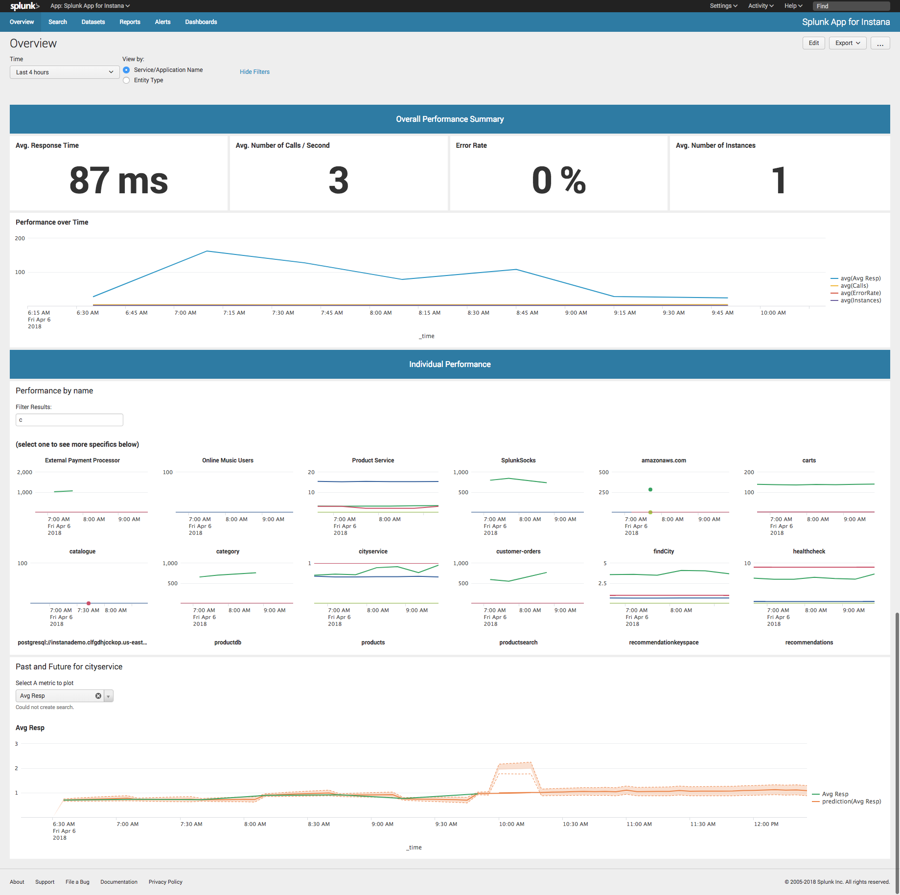
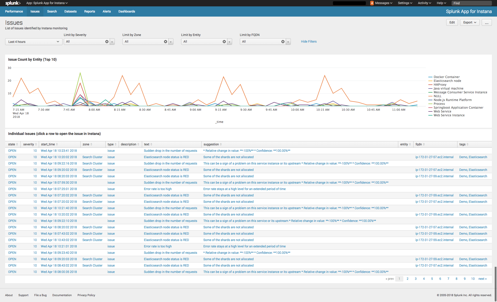

# Splunk Integration with Instana


## What's Needed?
- Downloads
    - Splunk Add-on for Instana
    - Splunk App for Instana

- Instana Information Required
    - Instana API tenanat URL   (https://&lt;your account&gt;.instana.io)
    - Instana API Authorization Token

- Splunk HTTP Event Collector (HEC) Token
    - Splunk HEC URL  (https://<Your_Splunk_Server>:8088/services/collector?token=&lt;your-token&gt;)
    - Splunk HEC Token
    - Splunk Basic Authentication Enablement   (allowQueryStringAuth = true)
    
- Instana Webhook


----  
# Instana Performance Metrics Configuration

### Installation
The installation consists of installing both the *Splunk Add-on for Instana* and the *Splunk App for Instana*.   
  - The Add-on is responsible for executing the rest API calls and collecting the data from Instana.  
  - The App provides a collection of dashboards and saved searches.  
  
To install, navigate to Apps --> Manage Apps and select the “Install app from File” button.  Specify the location of the file you downloaded and install it.   

### Configuration
The Splunk Add-on for Instana contains a global configuration for your Instana account URL and API authorization token.  

Enter those values on the **Configuration** tab in the Add-on.  You will find the settings in the **Add-On Settings** tab.

Next, create a new Input for the data you wish to collect via the **Inputs** menu -> **Create New Input** option.  Each Input requires 4 parameters:
  - Input Name 
  - Pollling interval
  - Splunk Index to use
  - Instana search filter that you would like to run (you can copy this directly from Instana's search bar)
  
  To retrieve metrics for all web applications and websites use this filter: 
  ```
  entity.pluginId:logicalwebapp OR entity.pluginId:browserLogicalService
  ```
  To retrieve metrics for all databases: 
  ```
  entity.selfType:database 
  ```
**Note:** This Add-on can be used for entities (Instana Snapshots) that contains the following 4 metrics:  
  - latency     ==> Average Response Time
  - count       ==> Calls per second
  - error_rate  ==> Error Rate
  - instances   ==> number of instances running this entity


### Start Searching
Once the Splunk Add-on for Instana is installed and configured you can execute searches using: 
```
sourcetype="instana:metrics"
```


----  
# Sending Instana Issues to Splunk

Instana automatically monitors for "Issues" within your monitored environment.  To have Instana send Splunk Notifications when Issues are triggered, you will setup 2 components; a Splunk HEC Token and an Instana Webhook.

### Splunk HTTP Event Collector (HEC) Token
- In Splunk, navigate to Settings --> HTTP Event Collector and create a "New Token".  Be sure to set the source value to instana so that the Splunk Issues dashboard will show your notifications. Note the token value as you'll need to use that in the Instana webhook setup below. 
    ```
    source=instana
    ```
- In Splunk query/basic authentication is disabled by default and it will neee to be enabled.  To enable this feature add the following to your <Splunk Home>/etc/system/inputs.conf file:
    ```
    [http://<input name>]
    allowQueryStringAuth = true
    ```
    
    For more details visit <a href="https://docs.splunk.com/Documentation/Splunk/7.0.3/Admin/Inputsconf">the Splunk documentation for inputs.conf</a> and search for "_allowQueryStringAuth_".  

### Instana Webhook
- In Instana, configure an "Integration" in your user "Settings".   You can find this your User Account in the upper right corner of the website.  
    - The URL should be: https://<Your_Splunk_Server>:8088/services/collector?token=&lt;your-token&gt; 
    


Now, when Instana triggers an issue, it will be automatically sent to Splunk!   


### Start Searching
Start Searching using: 
```
source="instana"
```

----  
# Screenshots
#### Performance Overview
<a href="Splunk_instana0.png" rel="Performance Screenshot"></a>

#### Issues Overview
<a href="Splunk_Instana_Issues.png" rel="Issues Screenshot"></a>

