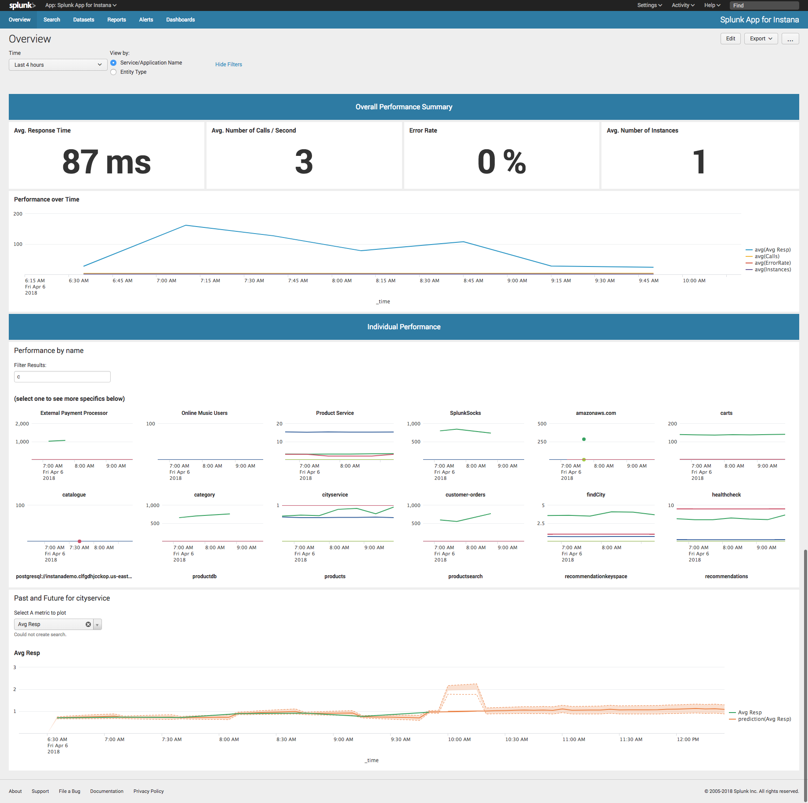
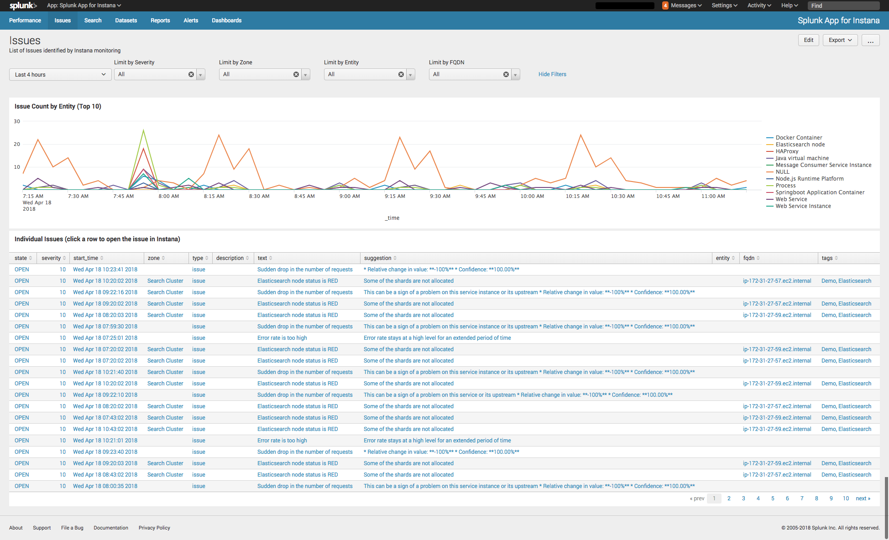

# Splunk Integration with Instana

## What's New?
- This Integration is now being maintained by Evgeni Wachnowezki of Instana! (evgeni.wachnowezki@instana.com)   
- This updated version utilizes the latest Instana APIs to collect metrics and ingest them into Splunk.
- The Issues data collection has not yet been migrated over, but that will come in a subsequent release.


## What's Needed?
- Downloads
    - Instana Add-on for Splunk
    - Instana App for Splunk

- Instana Information Required
    - Instana API tenanat URL   (https://&lt;your account&gt;.instana.io)
    - Instana API Authorization Token

- Splunk HTTP Event Collector (HEC) Token
    - Splunk HEC URL  (https://<Your_Splunk_Server>:8088/services/collector)
    - Splunk HEC Token
    

----  
# Instana Performance Metrics Configuration

### Installation
The installation consists of installing both the *Instana Add-on for Splunk* and the *Instana App for Splunk*.   
  - The Add-on is responsible for executing the rest API calls and collecting the data from Instana.  
  - The App provides a collection of dashboards and saved searches.  
  
To install, navigate to Apps --> Manage Apps and select the “Install app from File” button.  Specify the location of the file you downloaded and install it.   

### Configuration
The Instana Add-on for Splunk contains a global configuration for your Instana account URL and API authorization token.  

Enter those values on the **Configuration** tab in the Add-on.  You will find the settings in the **Add-On Settings** tab.

Next, create a new Input for the data you wish to collect via the **Inputs** menu -> **Create New Input** option.  Each Input requires 4 parameters:
  - Input Name 
  - Pollling interval
  - Splunk Index to use
  - Instana search filter that you would like to run (you can copy this directly from Instana's search bar)
  
  To retrieve metrics for all web applications and websites use this filter: 
  ```
  entity.pluginId:logicalwebapp OR entity.pluginId:browserLogicalService
  ```
  To retrieve metrics for all databases: 
  ```
  entity.selfType:database 
  ```
**Note:** This Add-on can be used for entities (Instana Snapshots) that contains the following 4 metrics:  
  - latency     ==> Average Response Time
  - count       ==> Calls per second
  - error_rate  ==> Error Rate
  - instances   ==> number of instances running this entity


### Start Searching
Once the Instana Add-on for Splunk is installed and configured you can execute searches using: 
```
sourcetype="instana:metrics"
```

----  
# Sending Instana Issues to Splunk

Instana automatically monitors for "Issues" within your monitored environment.  To have Instana send Splunk Notifications when Issues are triggered, you will setup 2 components; a Splunk HEC Token and an Instana Alerting Integration for Splunk.  

### Splunk HTTP Event Collector (HEC) Token
- In Splunk, navigate to Settings --> HTTP Event Collector and create a "New Token".  Note the token value as you'll need to use that in the Instana Alerting Integration. 


### Instana Alerting Integration for Splunk
- In Instana, configure an "Integration" in your user "Settings".   You can find this in your User Account in the upper right corner of the website. Follow the menus from Settings --> Alerting --> Integration then click on the Splunk button.  Once here enter the URL for your Splunk server (https://<Your_Splunk_Server>:8088/services/collector) and the Splunk HEC token you created above.  
- To configure which events are sent to Splunk go to Settings --> Alerting --> Configurations and select the event types and optionally define a filter, then select the Splunk integration.

Now, when Instana triggers an issue, it will be automatically sent to Splunk!   

### Start Searching
Start Searching using: 
```
sourcetype="instana:issues"
```

----  
# Screenshots
#### Performance Overview
<a href="images/Splunk_instana0.png" rel="Performance Screenshot"></a>

#### Issues Overview
<a href="images/Splunk_Instana_Issues.png" rel="Issues Screenshot"></a>

